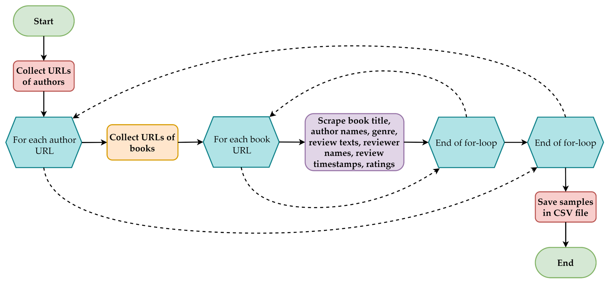
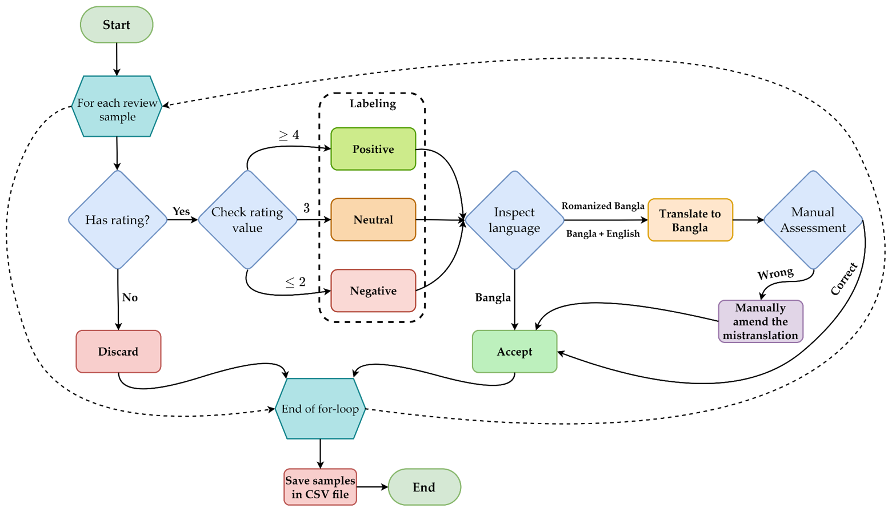
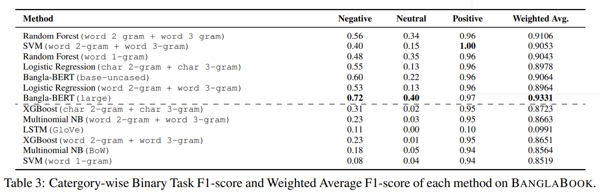

# BᴀɴɢʟᴀBᴏᴏᴋ: A Large-scale Bangla Dataset for Sentiment Analysis from Book Reviews
This repository contains the code, data, and models of the paper titled "BᴀɴɢʟᴀBᴏᴏᴋ: A Large-scale Bangla Dataset for Sentiment Analysis from Book Reviews" published in the ***Findings of the Association for Computational Linguistics: ACL 2023***.

[](https://arxiv.org/abs/2305.06595)
[](https://aclanthology.org/2023.findings-acl.80/)
[](https://tinyurl.com/gscholarbanglabook)
[](https://www.researchgate.net/publication/370688086_BanglaBook_A_Large-scale_Bangla_Dataset_for_Sentiment_Analysis_from_Book_Reviews)

[](https://aclanthology.org/2023.findings-acl.80.pdf)
[](https://drive.google.com/file/d/1-UkYs_Rx11S7qKOfR-6rnO2VDp3W78vQ/view?usp=sharing)
[](https://drive.google.com/file/d/1i7lnR2y3NdoglmYt31QR1R18mOOYtA76/view?usp=sharing)

**License:** Creative Commons Attribution-NonCommercial-ShareAlike 4.0 International

[](http://creativecommons.org/licenses/by-nc-sa/4.0/)

## Data Format
Each row consists of a book review sample. The table below describes what each column signifies.

Column Title | Description
------------ | -------------
`id` | The unique identification number of the sample
`Book_Name` | The title of the book that has been evaluated by the review
`Writer_Name` | The name of the book's author
`Category` | The genre to which the book belongs
`Rating` | A numerical value $`r`$ such that $`1\leq r \leq 5`$<br>A score reflecting the reviewer's subjective assessment of the book's quality
`Review` | The review text written by the reviewer
`Site` | The name of the online bookshop
`sentiment` | The conveyed sentiment and class label of the review<br>For a review sample $`i`$ with rating $`r_i`$, the sentiment label $`S_i`$ is,<br>$`S_i =\begin{cases}Negative, & \text{if $r_i \leq 2$}\\Neutral, & \text{if $r_i = 3$}\\Positive, & \text{if $r_i \geq 4$}\end{cases}`$
`label` | The numerical representation of the sentiment label<br>For a review sample $`i`$ with sentiment label $`S_i`$, the numerical label is,<br>$`label_i =\begin{cases}0, & \text{if $S_i = Negative$}\\1, & \text{if $S_i = Neutral$}\\2, & \text{if $S_i = Positive$}\end{cases}`$

## Data Construction
### Data Collection Process

### Labeling, Translation, and Validation of the Curated Samples


## Results


## Citation
If you find this work useful, please cite our paper:
```
@inproceedings{kabir-etal-2023-banglabook,
    title = "{B}angla{B}ook: A Large-scale {B}angla Dataset for Sentiment Analysis from Book Reviews",
    author = "Kabir, Mohsinul  and
      Bin Mahfuz, Obayed  and
      Raiyan, Syed Rifat  and
      Mahmud, Hasan  and
      Hasan, Md Kamrul",
    booktitle = "Findings of the Association for Computational Linguistics: ACL 2023",
    month = jul,
    year = "2023",
    address = "Toronto, Canada",
    publisher = "Association for Computational Linguistics",
    url = "https://aclanthology.org/2023.findings-acl.80",
    pages = "1237--1247",
    abstract = "The analysis of consumer sentiment, as expressed through reviews, can provide a wealth of insight regarding the quality of a product. While the study of sentiment analysis has been widely explored in many popular languages, relatively less attention has been given to the Bangla language, mostly due to a lack of relevant data and cross-domain adaptability. To address this limitation, we present BanglaBook, a large-scale dataset of Bangla book reviews consisting of 158,065 samples classified into three broad categories: positive, negative, and neutral. We provide a detailed statistical analysis of the dataset and employ a range of machine learning models to establish baselines including SVM, LSTM, and Bangla-BERT. Our findings demonstrate a substantial performance advantage of pre-trained models over models that rely on manually crafted features, emphasizing the necessity for additional training resources in this domain. Additionally, we conduct an in-depth error analysis by examining sentiment unigrams, which may provide insight into common classification errors in under-resourced languages like Bangla. Our codes and data are publicly available at https://github.com/mohsinulkabir14/BanglaBook.",
}
```
